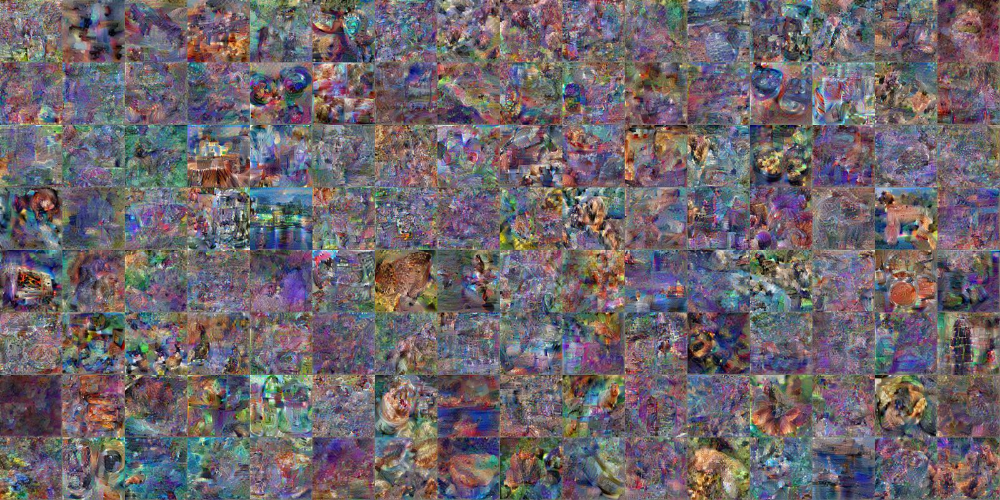

# Geminio: Language-Guided Gradient Inversion Attacks in Federated Learning


**Abstract**: Foundation models that bridge vision and language have made significant progress, inspiring numerous life-enriching applications. However, their potential for misuse to introduce new threats remains largely unexplored. This project reveals that vision-language models (VLMs) can be exploited to overcome longstanding limitations in gradient inversion attacks (GIAs) within federated learning (FL), where an FL server reconstructs private data samples from gradients shared by victim clients. Current GIAs face challenges in reconstructing high-resolution images, especially when the victim has a large local data batch. While focusing reconstruction on valuable samples rather than the entire batch is promising, existing methods lack the flexibility to allow attackers to specify their target data. In this project, we introduce Geminio, the first approach to transform GIAs into semantically meaningful targeted attacks. Geminio enables a brand new privacy attack experience: attackers can describe, in natural language, the types of data they consider valuable, and Geminio will prioritize reconstruction to focus on those high-value samples. This is achieved by leveraging a pretrained VLM to guide the optimization of a malicious global model that, when shared with and optimized by a victim, retains only gradients of samples that match the attacker-specified query. Extensive experiments demonstrate Geminio’s effectiveness in pinpointing and reconstructing targeted samples, with high success rates across complex datasets under FL and large batch sizes and showing resilience against existing defenses.

For more technical details and experimental results, we invite you to check out our paper **[here](http://arxiv.org/abs/2411.14937)**:  
**Junjie Shan, Ziqi Zhao, Jialin Lu, Rui Zhang, Siu Ming Yiu, and Ka-Ho Chow,** *"Geminio: Language-Guided Gradient Inversion Attacks in Federated Learning,"* International Conference on Computer Vision (ICCV), Honolulu, Hawai'i, Oct 19-23, 2025.

```bibtex
@inproceedings{shan2025geminio,
      title={Geminio: Language-Guided Gradient Inversion Attacks in Federated Learning}, 
      author={Junjie Shan and Ziqi Zhao and Jialin Lu and Rui Zhang and Siu Ming Yiu and Ka-Ho Chow},
      booktitle={International Conference on Computer Vision},
      year={2025}
}
```

## Setup
### Python Environment
This repository is implemented with Python 3.9. You can create a virtual environment and install the required libraries with the following command:
```bash
conda create --name geminio python=3.9
conda activate geminio
pip install -r requirements.txt
```
The MPS backend is tested on Apple M1 Max and Apple M2 Max, and the CUDA backend is tested on NVIDIA 5880 GPUs.

### Dataset Preparation
Before running the pipeline, ensure you have the following datasets prepared:
- **ImageNet**: Place validation dataset in `./data/imagenet/` (only ILSVRC2012_img_val.tar and ILSVRC2012_devkit_t12.tar.gz are required)

### Custom Private Data for Reconstruction
You can test reconstruction on your own private data by replacing images in `./assets/private_samples/`:

**Naming Format:** `{index}-{class}.png` (e.g., `1-285.png`, `2-45.png`)
- `index`: Sequential number starting from 1
- `class`: ImageNet class ID (0-999)


**Batch Size Configuration:**
Modify the batch size in `breaching/config/case/11_geminio_imagenet.yaml`:
```yaml
user:
  num_data_points: 64  # Change this to match your number of private images
```

### Project Structure
```
.
├── datasets/                    # Independent dataset implementations
├── malicious_models/           # Trained malicious models
├── core/                       # Core models and utilities
├── breaching/                  # Breaching framework
├── assets/                     # Sample private data
├── results/                    # Reconstruction results
├── vlm-*-embed.py             # VLM embedding preprocessing
├── main_geminio-*.py          # Malicious model training
├── main_breaching-*.py        # Gradient inversion attacks
├── reconstruct.py             # Unified reconstruction interface
└── test_pipeline_*.sh         # Pipeline testing scripts
```

## Complete Pipeline

### Phase 1: VLM Embedding Preprocessing

Generate CLIP embeddings for datasets to enable semantic guidance:

#### ImageNet Dataset  
```bash
python vlm-imagenet-embed.py
```
**Outputs:**
- `./data/imagenet-clip-test.pt` - ImageNet validation set embeddings (50,000 images)
- `./data/imagenet-clip-meta.pt` - Class metadata embeddings (1,000 classes)

### Phase 2: Malicious Model Training

Train query-specific malicious models that prioritize gradients matching semantic queries:

#### ImageNet Models
```bash
# Train models for all pre-defined queries
python main_geminio-imagenet.py

# This will train ResNet34 models for all 5 queries:
# - "Any jewelry?"
# - "Any human faces?" 
# - "Any males with a beard?"
# - "Any guns?"
# - "Any females riding a horse?"
```

**Outputs:** Trained models are saved as `./{query}-e5.pt` files (e.g., `./Any_jewelry-e5.pt`)

### Phase 3: Gradient Inversion Attack

Perform targeted gradient inversion attacks using the trained malicious models:

#### Dataset-Specific Scripts
```bash
# Baseline gradient inversion (no malicious model)
python main_breaching-imagenet.py --baseline

# Query-guided gradient inversion (using trained malicious models)
python main_breaching-imagenet.py --geminio-query "Any jewelry?"
python main_breaching-imagenet.py --geminio-query "Any human faces?"
python main_breaching-imagenet.py --geminio-query "Any males with a beard?"
python main_breaching-imagenet.py --geminio-query "Any guns?"
python main_breaching-imagenet.py --geminio-query "Any females riding a horse?"
```

#### Unified Interface
```bash
# Alternative interface supporting all datasets (if available)
python reconstruct.py --baseline
python reconstruct.py --geminio-query "Any jewelry?"
```

**Outputs:** Results saved to query-specific directories:
- `./results/baseline/` - For baseline reconstruction
- `./results/{query_name}/` - For query-guided reconstruction
  - `a_truth.jpg` - Ground truth private images
  - `final_rec.jpg` - Reconstructed images from gradient inversion

## Quick Start


### ImageNet Pipeline
```bash
# Step 1: Generate CLIP embeddings (run once)
python vlm-imagenet-embed.py

# Step 2: Train malicious models for all pre-defined queries
# (Optional - pre-trained models are already available in ./malicious_models/)
python main_geminio-imagenet.py

# Step 3: Perform gradient inversion attacks
# Baseline reconstruction (no query guidance)
python main_breaching-imagenet.py --baseline

# Query-guided reconstruction (using trained malicious models)
python main_breaching-imagenet.py --geminio-query "Any jewelry?"
python main_breaching-imagenet.py --geminio-query "Any human faces?"
```

### Automated Testing
Use the provided bash script for complete pipeline testing:
```bash
bash test_pipeline_imagenet.sh
```

This script will:
1. Generate VLM embeddings for ImageNet validation set
2. (Optional) Train malicious models for all 5 example queries (pre-trained models included)
3. Perform both baseline and targeted gradient inversion attacks

## Quick Start with Test Scripts

We provide automated test scripts for each dataset:

```bash
# Test complete ImageNet pipeline
bash test_pipeline_imagenet.sh
```

This script will:
1. Generate CLIP embeddings for ImageNet validation dataset
2. (Optional) Train malicious ResNet34 models for all 5 example semantic queries (pre-trained available)
3. Perform baseline gradient inversion attack (standard reconstruction)
4. Perform targeted gradient inversion attacks using trained malicious models for sample queries

## Query Support

### Custom Query Training
Geminio supports **any natural language query** for training malicious models. The models in `./malicious_models/` are pre-trained examples to get you started quickly:

**Example Queries:**
- "Any jewelry?"
- "Any human faces?" 
- "Any males with a beard?"
- "Any guns?"
- "Any females riding a horse?"

**Training Your Own Models:**
To train models for your own queries, modify the `queries` list in `main_geminio-imagenet.py`:
```python
queries = [
    "Your custom query here",
    "Any vehicles?", 
    "People wearing glasses?",
    "Animals in the wild?",
    "Outdoor scenes?",
    "Text or documents?",
    # Add any natural language query you want!
]
```

Then run:
```bash
python main_geminio-imagenet.py
```

Your new models will be saved to `./malicious_models/{query_name}.pt` and can immediately be used for reconstruction.

## Expected Outputs

### VLM Embeddings (Generated Once)
- `./data/imagenet-clip-test.pt` - ImageNet validation set CLIP embeddings (50,000 images)
- `./data/imagenet-clip-meta.pt` - Class name text embeddings (1,000 classes)

### Pre-trained Malicious Models (Examples)
The `./malicious_models/` folder contains **pre-trained example models** for demonstration:
- `./malicious_models/Any_jewelry.pt` - Model optimized for jewelry detection
- `./malicious_models/Any_human_faces.pt` - Model optimized for face detection  
- `./malicious_models/Any_males_with_a_beard.pt` - Model optimized for bearded men detection
- `./malicious_models/Any_guns.pt` - Model optimized for weapon detection
- `./malicious_models/Any_females_riding_a_horse.pt` - Model optimized for specific scene detection

**Note:** These are just examples. You can train models for **any custom query** using `main_geminio-imagenet.py` - simply modify the `queries` list with your own natural language descriptions.

### Reconstruction Results
Results are saved in query-specific folders:
- `./results/baseline/` - Baseline reconstruction results (no query)
- `./results/{query_name}/` - Query-specific reconstruction results
  - `a_truth.jpg` - Ground truth private images
  - `final_rec.jpg` - Reconstructed images from gradients

Examples:
- `./results/Any_jewelry/a_truth.jpg`, `./results/Any_jewelry/final_rec.jpg`
- `./results/Any_human_faces/a_truth.jpg`, `./results/Any_human_faces/final_rec.jpg`

## Customization and Extension

### Adding New Datasets

To support additional datasets beyond ImageNet:

1. **Create Dataset Implementation**: Add a new dataset class in `datasets/` following the pattern of `geminio_imagenet.py`. Your dataset must return `(image, image_embedding, target, target)` tuples.

2. **Generate VLM Embeddings**: Create a VLM embedding script similar to `vlm-imagenet-embed.py` for your dataset.

3. **Update Breaching Integration**: 
   - Add dataset configuration in `breaching/config/case/data/{YourDataset}.yaml`
   - Add case configuration in `breaching/config/case/{case_name}.yaml`  
   - Add dataset handling in `breaching/cases/data/datasets_vision.py`

4. **Create Training Script**: Modify `main_geminio-imagenet.py` or create a new training script for your dataset.

5. **Update Reconstruction Script**: Modify `main_breaching-imagenet.py` for your dataset's specific requirements.

### Adding New Model Architectures

To experiment with different model architectures:

1. **Add Model Definition**: Define new architectures in `core/models.py` following the `GeminioResNet` pattern.

2. **Update Training Script**: Add your model type to the model selection logic in `main_geminio-imagenet.py`.

3. **Update Configurations**: Modify `breaching/config/case/*.yaml` files to specify your model architecture.

### Fine-tuning Reconstruction Quality

To improve gradient inversion attack performance, modify hyperparameters in:

**`breaching/config/attack/hfgradinv.yaml`**


Refer to the [breaching documentation](https://github.com/JonasGeiping/breaching) for detailed hyperparameter descriptions.

## Results and Demonstration

### Sample Private Data
We selected the following 128 images from ImageNet as the private samples for demonstration:


### Baseline vs. Geminio Comparison

**Baseline Attack**: Standard gradient inversion using HFGradInv to reconstruct from a batch of 128 private samples:

```bash
python reconstruct.py --baseline
```



**Geminio Targeted Attack**: Semantic query-guided reconstruction that prioritizes specific types of data:

```bash
python reconstruct.py --geminio-query="Any jewelry?"
```

### Reconstruction Results by Query

Below are example reconstruction results demonstrating Geminio's ability to target specific semantic content:

- **Query: "Any jewelry?"**
  

- **Query: "Any human faces?"**
  

- **Query: "Any males with a beard?"**
  

- **Query: "Any guns?"**
  

- **Query: "Any females riding a horse?"** 
  

## Pipeline Summary

The complete Geminio pipeline consists of three main phases:

1. **VLM Embedding Preprocessing** → Generate CLIP embeddings that capture semantic meaning
2. **Malicious Model Training** → Train models that prioritize gradients matching target queries  
3. **Gradient Inversion Attack** → Perform targeted reconstruction using trained malicious models

This approach transforms traditional gradient inversion attacks from indiscriminate reconstruction to precise, semantically-guided targeting of valuable data samples.

## Acknowledgement
We would like to acknowledge the repositories below.
* [breaching](https://github.com/JonasGeiping/breaching)
* [2023YeHFGradInv](https://github.com/MiLab-HITSZ/2023YeHFGradInv)
